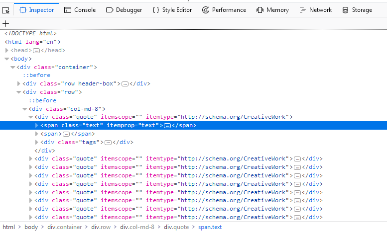
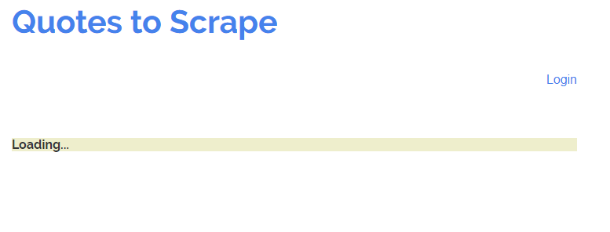
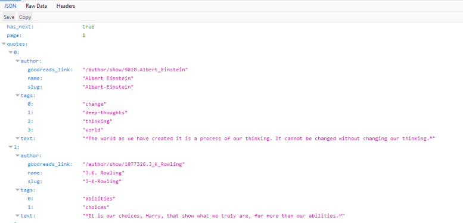

# 使用浏览器的开发人员工具进行抓取

> 译者：[OSGeo 中国](https://www.osgeo.cn/)

下面是关于如何使用浏览器的开发人员工具来简化抓取过程的一般指南。现在几乎所有浏览器都内置了 [Developer Tools](https://en.wikipedia.org/wiki/Web_development_tools) 尽管我们将在本指南中使用firefox，但这些概念适用于任何其他浏览器。

在本指南中，我们将介绍通过抓取从浏览器的开发人员工具中使用的基本工具 [quotes.toscrape.com](http://quotes.toscrape.com) .

## 检查实时浏览器DOM时的注意事项

由于开发人员工具在一个活动的浏览器DOM上运行，所以在检查页面源代码时，您实际上看到的不是原始的HTML，而是应用了一些浏览器清理和执行javascript代码后修改的HTML。尤其是火狐，以添加 `&lt;tbody&gt;` 元素到表。另一方面，scrapy不修改原始页面html，因此如果使用 `&lt;tbody&gt;` 在xpath表达式中。

因此，您应该记住以下几点：

*   检查DOM以查找要在Scrapy中使用的xpaths时禁用javascript（在“开发人员工具”设置中，单击 &lt;cite&gt;Disable JavaScript&lt;/cite&gt;)
*   不要使用完整的xpath路径，使用基于属性的相对路径和智能路径（例如 `id` ， `class` ， `width` 或任何识别特征，如 `contains(@href, 'image')` .
*   从不包括 `&lt;tbody&gt;` xpath表达式中的元素，除非您真正知道自己在做什么

## 查看网站

到目前为止，开发人员工具最方便的特性是 &lt;cite&gt;Inspector&lt;/cite&gt; 功能，允许您检查任何网页的基本HTML代码。为了演示检查员，让我们看看 [quotes.toscrape.com](http://quotes.toscrape.com) 现场。

在这个网站上，我们总共有来自不同作者的十个引用，其中有特定的标签，还有前十个标签。假设我们想要提取这个页面上的所有引用，而不需要任何关于作者、标签等的元信息。

我们不必查看页面的整个源代码，只需右键单击一个报价并选择 `Inspect Element (Q)` 打开了 &lt;cite&gt;Inspector&lt;/cite&gt;. 在里面你应该看到这样的东西：

[](../_images/inspector_01.png)

我们感兴趣的是：

```py
<div class="quote" itemscope="" itemtype="http://schema.org/CreativeWork">
  <span class="text" itemprop="text">(...)</span>
  <span>(...)</span>
  <div class="tags">(...)</div>
</div>

```

如果你在第一个上面徘徊 `div` 正上方 `span` 在屏幕截图中突出显示的标签，您将看到网页的相应部分也会突出显示。现在我们有了一个部分，但是我们在任何地方都找不到报价文本。

的优势 &lt;cite&gt;Inspector&lt;/cite&gt; 它自动展开和折叠网页的部分和标签，大大提高了可读性。您可以通过单击标签前面的箭头或直接双击标签来展开和折叠标签。如果我们扩大 `span` 带标签 `class= "text"` 我们将看到我们单击的报价文本。这个 &lt;cite&gt;Inspector&lt;/cite&gt; 允许将xpaths复制到选定元素。让我们试试看：右键单击 `span` 选择标记 `Copy &gt; XPath` 然后像这样把它贴在破壳里：

```py
$ scrapy shell "http://quotes.toscrape.com/"
(...)
>>> response.xpath('/html/body/div/div[2]/div[1]/div[1]/span[1]/text()').getall()
['"The world as we have created it is a process of our thinking. It cannot be changed without changing our thinking.”]

```

添加 `text()` 最后，我们可以用这个基本选择器提取第一个报价。但这个xpath并没有那么聪明。它所做的就是在源代码中沿着所需的路径从 `html` . 那么让我们看看我们是否可以改进一下xpath：

如果我们检查 &lt;cite&gt;Inspector&lt;/cite&gt; 我们将再次看到，在我们的 `div` 标签我们有九个相同的 `div` 标签，每个标签都具有与第一个相同的属性。如果我们扩展其中任何一个，我们将看到与第一个报价相同的结构：两个 `span` 标签和一个 `div` 标签。我们可以扩大每个 `span` 带标签 `class="text"` 在我们内部 `div` 标记并查看每个引用：

```py
<div class="quote" itemscope="" itemtype="http://schema.org/CreativeWork">
  <span class="text" itemprop="text">
    “The world as we have created it is a process of our thinking. It cannot be changed without changing our thinking.”
  </span>
  <span>(...)</span>
  <div class="tags">(...)</div>
</div>

```

有了这些知识，我们可以改进我们的xpath：我们只需选择 `span` 标签与 `class="text"` 通过使用 [has-class-extension](https://parsel.readthedocs.io/en/latest/usage.html#other-xpath-extensions) ：：

```py
 >>> response.xpath('//span[has-class("text")]/text()').getall()
['"The world as we have created it is a process of our thinking. It cannot be changed without changing our thinking.”,
 '“It is our choices, Harry, that show what we truly are, far more than our abilities.”',
 '“There are only two ways to live your life. One is as though nothing is a miracle. The other is as though everything is a miracle.”',
 (...)]

```

通过一个简单、更聪明的xpath，我们能够从页面中提取所有的引号。我们可以在第一个xpath上构建一个循环，以增加最后一个xpath的数量。 `div` ，但这将不必要地复杂，只需使用 `has-class("text")` 我们能够在一行中提取所有报价。

这个 &lt;cite&gt;Inspector&lt;/cite&gt; 还有很多其他有用的功能，比如在源代码中搜索或者直接滚动到您选择的元素。让我们演示一个用例：

说你想找到 `Next` 页面上的按钮。类型 `Next` 在搜索栏的右上角 &lt;cite&gt;Inspector&lt;/cite&gt;. 你应该得到两个结果。第一个是 `li` 带标签 `class="text"` ，第二个是 `a` 标签。右键单击 `a` 标记与选择 `Scroll into View` . 如果您将鼠标悬停在标签上，您将看到突出显示的按钮。从这里我们可以很容易地创建一个 [Link Extractor](link-extractors.html#topics-link-extractors) 跟随分页。在这样一个简单的站点上，可能不需要从视觉上查找元素，而是 `Scroll into View` 函数在复杂的站点上非常有用。

请注意，搜索栏也可用于搜索和测试CSS选择器。例如，您可以搜索 `span.text` 查找所有报价文本。而不是全文搜索，这将搜索 `span` 带标签 `class="text"` 在页面中。

## 网络工具

在抓取过程中，您可能会遇到动态网页，其中页面的某些部分是通过多个请求动态加载的。虽然这很棘手，但是 &lt;cite&gt;Network&lt;/cite&gt;- 开发人员工具中的工具大大简化了这项任务。为了演示网络工具，让我们看一下页面 [quotes.toscrape.com/scroll](quotes.toscrape.com/scroll/) .

页面与基本页面非常相似 [quotes.toscrape.com](http://quotes.toscrape.com) -第页，但不是上面提到的 `Next` 按钮，当您滚动到底部时，页面会自动加载新的引号。我们可以继续直接尝试不同的xpaths，但是我们将检查另一个非常有用的命令，来自scriby shell:：

```py
$ scrapy shell "quotes.toscrape.com/scroll"
(...)
>>> view(response)

```

浏览器窗口应该和网页一起打开，但有一个关键的区别：我们看到的不是引用，而是一个带单词的绿色条。 `Loading...` .

[](../_images/network_01.png)

这个 `view(response)` 命令让我们查看shell或稍后 Spider 从服务器接收到的响应。这里我们看到加载了一些基本模板，其中包括标题、登录按钮和页脚，但是缺少引号。这告诉我们报价是从不同的请求加载的，而不是 `quotes.toscrape/scroll` .

如果你点击 `Network` 选项卡，您可能只能看到两个条目。我们要做的第一件事是通过单击 `Persist Logs` . 如果禁用此选项，则每次导航到不同的页面时，日志都会自动清除。启用这个选项是一个很好的默认设置，因为它可以让我们控制何时清除日志。

如果我们现在重新加载页面，您将看到日志中填充了六个新的请求。

[](../_images/network_02.png)

在这里，我们可以看到在重新加载页面时发出的每个请求，并且可以检查每个请求及其响应。因此，让我们找出我们的报价来自哪里：

首先单击带有名称的请求 `scroll` . 在右边，您现在可以检查请求。在 `Headers` 您将找到有关请求头的详细信息，例如URL、方法、IP地址等。我们将忽略其他选项卡并直接单击 `Reponse` .

你应该在里面看到什么 `Preview` 窗格是呈现的HTML代码，这正是我们调用 `view(response)` 在贝壳里。相应地 `type` 日志中的请求为 `html` . 其他请求的类型如下 `css` 或 `js` 但是我们感兴趣的是一个要求 `quotes?page=1` 与类型 `json` .

如果我们点击这个请求，我们会看到请求的URL是 `http://quotes.toscrape.com/api/quotes?page=1` 响应是一个包含我们的引号的JSON对象。我们也可以右键单击请求并打开 `Open in new tab` 以获得更好的概述。

[](../_images/network_03.png)

有了这个响应，我们现在可以轻松地解析JSON对象，并请求每个页面获取站点上的每个引用：

```py
import scrapy
import json

class QuoteSpider(scrapy.Spider):
    name = 'quote'
    allowed_domains = ['quotes.toscrape.com']
    page = 1
    start_urls = ['http://quotes.toscrape.com/api/quotes?page=1']

    def parse(self, response):
        data = json.loads(response.text)
        for quote in data["quotes"]:
            yield {"quote": quote["text"]}
        if data["has_next"]:
            self.page += 1
            url = "http://quotes.toscrape.com/api/quotes?page={}".format(self.page)
            yield scrapy.Request(url=url, callback=self.parse)

```

这个 Spider 程序从QuotesAPI的第一页开始。对于每个响应，我们分析 `response.text` 并分配给 `data` . 这让我们可以像在Python字典上一样对JSON对象进行操作。我们迭代 `quotes` 打印出 `quote["text"]` . 如果方便的话 `has_next` 元素是 `true` （尝试加载 [quotes.toscrape.com/api/quotes?page=10](http://quotes.toscrape.com/api/quotes?page=10) 在您的浏览器或大于10的页码中，我们增加 `page` 属性与 `yield` 一个新的请求，将递增的页码插入到 `url` .

你可以看到，在 &lt;cite&gt;Network&lt;/cite&gt;- 工具我们能够轻松地复制页面滚动功能的动态请求。对动态页面进行爬行可能非常困难，页面也可能非常复杂，但是（主要）归根结底就是识别正确的请求并在 Spider 中复制它。