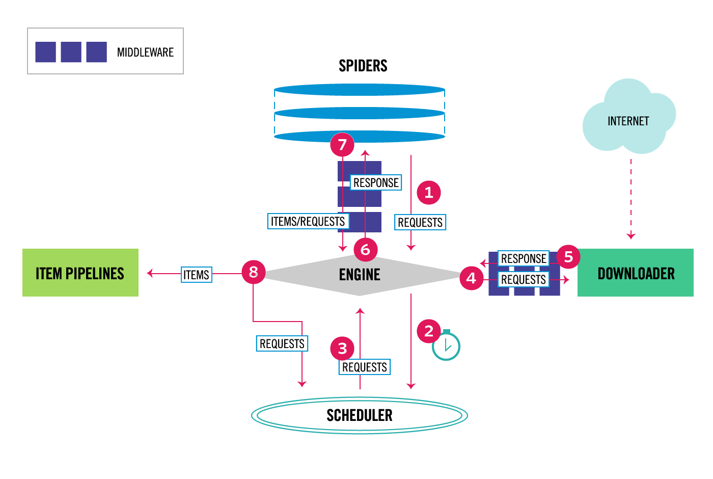

# 体系结构概述

> 译者：[OSGeo 中国](https://www.osgeo.cn/)

本文描述了Scrapy的体系结构及其组件如何交互。

## 概述

下图显示了Scrapy架构及其组件的概述，以及系统内部发生的数据流的概要（以红色箭头显示）。下面提供了这些组件的简要说明以及有关它们的详细信息的链接。数据流也描述如下。

## 数据流

Scrapy中的数据流由执行引擎控制，如下所示：

1.  这个 [Engine](#component-engine) 获取要从 [Spider](#component-spiders) .
2.  这个 [Engine](#component-engine) 在中安排请求 [Scheduler](#component-scheduler) 并请求下一个要爬行的请求。
3.  这个 [Scheduler](#component-scheduler) 将下一个请求返回到 [Engine](#component-engine) .
4.  这个 [Engine](#component-engine) 将请求发送到 [Downloader](#component-downloader) ，通过 [Downloader Middlewares](#component-downloader-middleware) （见 [`process_request()`](downloader-middleware.html#scrapy.downloadermiddlewares.DownloaderMiddleware.process_request "scrapy.downloadermiddlewares.DownloaderMiddleware.process_request") ）
5.  一旦页面完成下载， [Downloader](#component-downloader) 生成响应（使用该页）并将其发送到引擎，并通过 [Downloader Middlewares](#component-downloader-middleware) （见 [`process_response()`](downloader-middleware.html#scrapy.downloadermiddlewares.DownloaderMiddleware.process_response "scrapy.downloadermiddlewares.DownloaderMiddleware.process_response") ）
6.  这个 [Engine](#component-engine) 接收来自的响应 [Downloader](#component-downloader) 并发送到 [Spider](#component-spiders) 用于处理，通过 [Spider Middleware](#component-spider-middleware) （见 [`process_spider_input()`](spider-middleware.html#scrapy.spidermiddlewares.SpiderMiddleware.process_spider_input "scrapy.spidermiddlewares.SpiderMiddleware.process_spider_input") ）
7.  这个 [Spider](#component-spiders) 处理响应并向 [Engine](#component-engine) ，通过 [Spider Middleware](#component-spider-middleware) （见 [`process_spider_output()`](spider-middleware.html#scrapy.spidermiddlewares.SpiderMiddleware.process_spider_output "scrapy.spidermiddlewares.SpiderMiddleware.process_spider_output") ）
8.  这个 [Engine](#component-engine) 将已处理的项目发送到 [Item Pipelines](#component-pipelines) ，然后将已处理的请求发送到 [Scheduler](#component-scheduler) 并请求可能的下一个爬行请求。
9.  该过程重复（从步骤1开始），直到不再有来自 [Scheduler](#component-scheduler) .

## 组件

### 抓取式发动机

引擎负责控制系统所有组件之间的数据流，并在发生某些操作时触发事件。见 [Data Flow](#data-flow) 有关详细信息，请参阅上面的部分。

### 调度程序

调度器接收来自引擎的请求，并将它们排队，以便在引擎请求时（也向引擎）提供这些请求。

### 下载器

下载者负责获取网页并将其送入引擎，引擎反过来又将网页送入 Spider 。

### Spider

spider是由scraphy用户编写的自定义类，用于解析响应并从中提取项目（也称为scraped项）或后续的附加请求。有关详细信息，请参阅 [Spider](spiders.html#topics-spiders) .

### 项目管道

项目管道负责处理被 Spider 提取（或 Scrape）的项目。典型的任务包括清理、验证和持久性（如将项目存储在数据库中）。有关详细信息，请参阅 [项目管道](item-pipeline.html#topics-item-pipeline) .

### 下载器中心件

下载器中间件是位于引擎和下载器之间的特定Hook，当它们从引擎传递到下载器时处理请求，以及从下载器传递到引擎的响应。

如果需要执行以下操作之一，请使用下载器中间件：

*   在将请求发送给下载者之前处理该请求（即在Scrapy将请求发送到网站之前）；
*   变更在传递给spider之前收到响应；
*   发送新的请求，而不是将收到的响应传递给spider；
*   在不获取网页的情况下将响应传递给 Spider ；
*   悄悄地放弃一些请求。

有关详细信息，请参阅 [下载器中间件](downloader-middleware.html#topics-downloader-middleware) .

### Spider 中心件

Spider 中间件是位于引擎和 Spider 之间的特定Hook，能够处理 Spider 的输入（响应）和输出（项目和请求）。

如果需要，使用 Spider 中间件

*   post-process output of spider callbacks - change/add/remove requests or items;
*   后处理启动请求；
*   处理spider异常；
*   对一些基于响应内容的请求调用errback，而不是回调。

有关详细信息，请参阅 [Spider 中间件](spider-middleware.html#topics-spider-middleware) .

## 事件驱动的网络

Scrapy是用 [Twisted](https://twistedmatrix.com/trac/) 是一个流行的事件驱动的python网络框架。因此，它使用非阻塞（即异步）代码实现并发性。

有关异步编程和扭曲的更多信息，请参阅以下链接：

*   [Introduction to Deferreds in Twisted](https://twistedmatrix.com/documents/current/core/howto/defer-intro.html)
*   [Twisted - hello, asynchronous programming](http://jessenoller.com/blog/2009/02/11/twisted-hello-asynchronous-programming/)
*   [Twisted Introduction - Krondo](http://krondo.com/an-introduction-to-asynchronous-programming-and-twisted/)